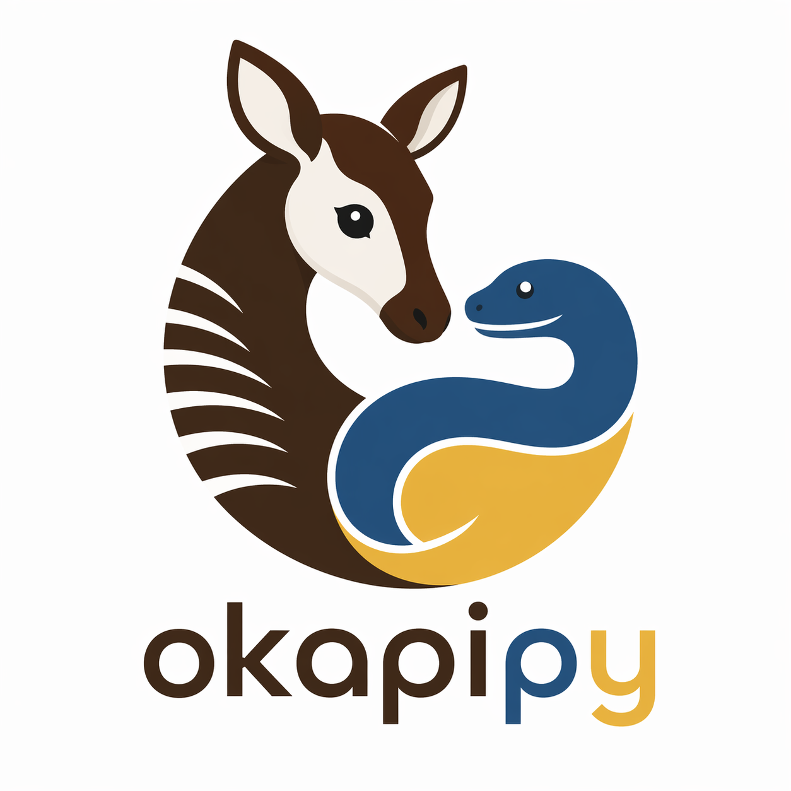

---
hide:
  - navigation
  - toc
---

<div class="okapi-hero" markdown>

{ .okapi-logo }

# okapipy

<p class="okapi-tagline">
  Turn a flat OpenAPI 3.x document into a typed, hierarchical Python
  client — without losing your hand-written code on every spec change.
</p>

<p class="okapi-badges">
  <a href="https://github.com/ffaraone/okapipy/releases/latest"></a>
  <a href="https://pypi.org/project/okapipy/"></a>
  <a href="https://pypi.org/project/okapipy/"></a>
  <a href="https://github.com/ffaraone/okapipy/blob/main/LICENSE"></a>
  <a href="https://github.com/ffaraone/okapipy/actions/workflows/ci.yml"></a>
</p>

<div class="okapi-cta" markdown>
[Quick start :material-rocket-launch:](user-guide/quick-start.md){ .md-button .md-button--primary }
[Install :material-download:](user-guide/installation.md){ .md-button }
[GitHub :fontawesome-brands-github:](https://github.com/ffaraone/okapipy){ .md-button }
</div>

</div>

## Why okapipy?

Every Python team that consumes a third-party REST API ends up writing
the same wrapper twice: once to talk to the network, once to make the
result feel like Python. The first half is mechanical and boring (URLs,
JSON, headers, retries, pagination) and the second half is where the
value is (domain methods, business logic, integration tests). Most
generators only solve the first half — they hand you a flat list of
operations, one method per OpenAPI path, and you spend the next quarter
hand-wrapping them into something usable.

okapipy does both. It reads your OpenAPI 3.x document and **recovers the
structure** the spec is too flat to express: plurals become
**collections**, `{id}` segments become **resources**, verbs become
**actions**, and folder-style prefixes (`/auth`, `/commerce`,
`/settings`) become **namespaces**. The result is a client where
`client.commerce.orders["ord_42"].submit()` reads like the API it
represents — not `client.commerce_orders_submit(id="ord_42")` like it
came out of a Postman export.

The other half okapipy gets right is **regeneration**. Generated code is
emitted in two layers: a `base/` tree the generator owns and rewrites on
every run, and a thin user layer the generator emits **once** and then
leaves alone forever. You add custom methods, swap transports, wire
authentication, override request bodies — all in plain Python
subclasses, no DSL, no protected-region markers. When the upstream spec
changes a year from now, you re-run one command, the `base/` tree
catches up, and your code is exactly where you left it.

## A 30-second tour

```bash
pip install okapipy
okapipy spec generate https://api.example.com/openapi.json \
    --output ./my-client \
    --package acme.commerce \
    --client-class CommerceClient
```

```python
from acme.commerce import CommerceClient

with CommerceClient(base_url="https://api.example.com") as client:
    # Iterate a collection — pagination handled by the configured strategy.
    for order in client.commerce.orders.filter(status="open").page_size(50):
        print(order.id, order.total)

    # Resources are looked up with [id], not (id).
    order = client.commerce.orders["ord_42"].retrieve()

    # Sub-collections, sub-resources — they walk the tree naturally.
    new_line = client.commerce.orders["ord_42"].lines.create(
        body={"sku": "SKU-1", "qty": 2},
    )

    # Actions live where they belong: under the resource that owns them.
    client.commerce.orders["ord_42"].submit.run()
```

Async? Same shape, `Async`-prefixed:

```python
from acme.commerce import AsyncCommerceClient

async with AsyncCommerceClient(base_url="...") as client:
    async for order in client.commerce.orders:
        ...
```

## What's in the box

<div class="grid cards" markdown>

-   :material-tree:{ .lg .middle } **Structural parser**

    ---

    Lifts a flat OpenAPI 3.x spec into a hierarchical tree using POS
    tagging plus a small heuristic registry. Override anything with
    `x-okapipy-*` extensions or a project-local rules file.

    [:octicons-arrow-right-24: Rules and extensions](user-guide/rules.md)

-   :material-code-braces:{ .lg .middle } **Two-layer code generation**

    ---

    A regenerated `base/` layer holds wiring, transport, and Pydantic
    models. A one-shot user layer holds your overrides. Re-running the
    generator never touches your code.

    [:octicons-arrow-right-24: Customization model](user-guide/customization.md)

-   :material-page-next:{ .lg .middle } **Pluggable strategies**

    ---

    Pagination, filter, and sort encodings are duck-typed Protocols
    with sensible built-ins (offset/limit, page/cursor, RFC 5988,
    JSON:API, …). Bring your own when the API does something custom.

    [:octicons-arrow-right-24: Strategies](user-guide/strategies.md)

-   :material-file-code:{ .lg .middle } **Hookable templates**

    ---

    Every generated file is rendered from a Jinja template you can
    override per project — change the file header, the docstring style,
    the model layout, or the project skeleton. The packaged defaults
    work out of the box.

    [:octicons-arrow-right-24: Template customization](user-guide/templates.md)

-   :material-sync:{ .lg .middle } **Lossless regeneration**

    ---

    Re-run `okapipy spec generate` whenever the spec moves. Your user
    code is left strictly alone; new namespaces and collections show up
    as drift warnings telling you exactly which line to add.

    [:octicons-arrow-right-24: Regeneration semantics](user-guide/customization.md#regeneration-semantics)

-   :material-language-python:{ .lg .middle } **Modern Python only**

    ---

    Python 3.12+, Pydantic v2, `httpx`. Type-checked under
    `mypy --strict` on the parser and generator. Sync **and** async
    clients, side by side, sharing the same tree.

    [:octicons-arrow-right-24: Installation](user-guide/installation.md)

</div>

## Get going in five minutes

1. **Install.** `pip install okapipy` (or `uv add okapipy`).
2. **Pre-warm the spaCy model.** `okapipy nlp fetch en` — ~12 MB,
   one-time cost.
3. **Sanity-check your spec.** `okapipy spec parse openapi.yaml` prints a
   structural tree and a counts panel; if any classifications look off,
   fix them in the rules file (see [Rules and extensions][rules]) before
   you generate.
4. **Generate.** `okapipy spec generate openapi.yaml --output ./client
   --package acme.commerce --client-class CommerceClient`.
5. **Use it.** `from acme.commerce import CommerceClient`. The full
   surface — every collection, resource, action, sub-namespace — is
   already wired through the user-layer subclasses; you only edit them
   when you want to specialize.

That's the whole loop. There is no step 6.

## Status

okapipy is in active development (beta). The parser is stable and ships
today; the generator is implemented and emits a runnable client project
with sync + async surfaces, vendored runtime, manifest-driven drift
detection, and full template customization. The customer-facing API is
still settling — pin to a specific version until 1.0.

## License

okapipy is released under the
[Apache License 2.0](https://github.com/ffaraone/okapipy/blob/main/LICENSE).
You're free to use it commercially, modify it, and redistribute it;
please keep the copyright notice and the license text intact.

[rules]: user-guide/rules.md
